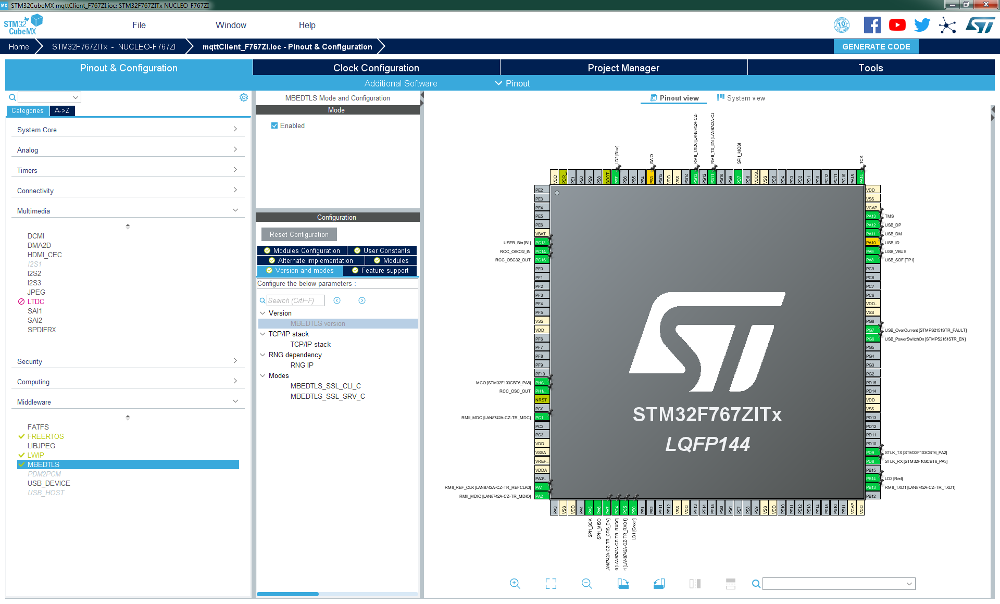
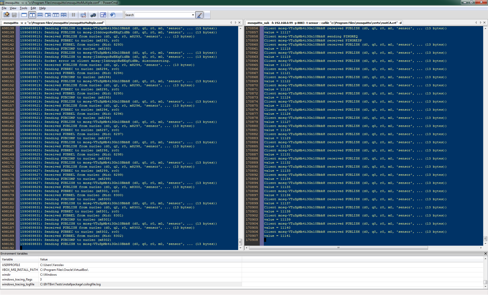
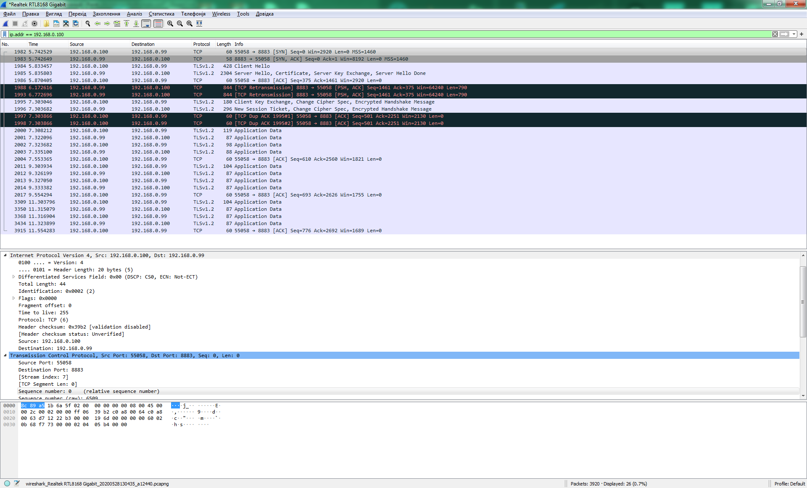

# About project

Simple project of mqtt client for STM32F767. 
Based on:
- STM32Cube_FW_F7_V1.16.0
- FREERTOS CMSIS_V2 
- LWIP 2.1.2 
- MBEDTLS 2.16.2

# Mosquitto config

```
# MQTT over TLS/SSL
listener 8883
protocol mqtt
cafile "Path to cert folder"\rootCA.crt
certfile "Path to cert folder"\server.crt
keyfile "Path to cert folder"\server.key 
```
- server launch:
```
 mosquitto -v -c "c:\Program Files\mosquitto\mosquitto.conf"
```
- client launch (for additional monitoring):
```
mosquitto_sub -h 192.168.0.99 -p 8883 -t sensor --cafile "Path to cert folder\rootCA.crt" -d
```

# Functionality

Just connect with TLS 1.2 to broker by IPv4 and send messages.

# ToDo
MqttClient_t class:
 - write mechanism for incomming mqtt telegrams
 - improve logic machine for reconnect and processing network collisions
 - rework mechanism for callbaks
 - DNS name resolving
 
 
 
 
 
 
 